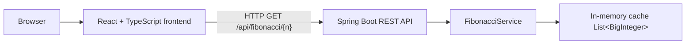

# Fibonacci App

## Overview

This project is a small technical exercise designed to demonstrate a complete stack around the Fibonacci sequence: backend logic, API design, caching, frontend interaction, API documentation, and containerized execution.

The user enters an index `n` and receives the corresponding Fibonacci value `F(n)`. The application is intentionally compact, but it exercises several core engineering concerns:

- Java + Spring Boot backend
- iterative algorithm design
- large-number handling with `BigInteger`
- in-memory cache behavior
- REST API contract and validation
- React + TypeScript frontend
- CORS handling for local development and Docker
- OpenAPI / Swagger documentation
- Docker and Docker Compose orchestration

---

## Features

- Fibonacci calculation for non-negative indices
- support for large values using `BigInteger`
- in-memory cache to reuse previously computed values
- REST API endpoint for Fibonacci queries
- cached indicator in API response
- validation of invalid input on both frontend and backend
- global exception handling for bad requests
- React interface for entering values and displaying results
- Swagger UI for interactive API documentation
- separate Docker images for backend and frontend
- Docker Compose setup for full local execution

---

## Architecture



At runtime the frontend runs as a static app served by nginx in a container, while the backend runs as a Spring Boot application in its own container. Both services are exposed on different ports so they can be used independently and together through Docker Compose.

---

## Tech Stack

### Backend

- Java 21
- Spring Boot 4.1.0
- Maven
- Spring Web MVC
- Validation starter
- `org.springdoc:springdoc-openapi-starter-webmvc-ui:3.0.3`
- JUnit 5 / MockMvc

### Frontend

- React 19
- TypeScript ~6.0.2
- Vite 8.2.0
- native `fetch` API for HTTP requests
- CSS styling without a UI library

### Infrastructure

- Docker
- Docker Compose
- nginx 1.26-alpine for frontend static hosting
- multi-stage Docker builds

---

## Fibonacci Algorithm

The implementation uses an iterative approach, not a naive recursive one.

The mathematical definition is:

- `F(0) = 0`
- `F(1) = 1`
- `F(n) = F(n-1) + F(n-2)` for `n >= 2`

The service starts from the base sequence `[0, 1]` and computes forward one value at a time. This avoids redundant work that recursive implementations often do.

The algorithmic complexity is:

- Time: `O(n)` for a single new index
- Space: `O(1)` extra memory without cache usage, or `O(n)` when the full calculated sequence is retained in the cache

This design is a good fit for a simple exercise because it is predictable and easy to reason about.

---

## BigInteger

The project intentionally uses `BigInteger` instead of `int`, `long`, or `double`.

This decision is necessary because Fibonacci numbers grow very quickly. `F(92)` still fits in a Java `long`, but `F(93)` already exceeds `Long.MAX_VALUE`.

Using `BigInteger` ensures:

- correct arithmetic for large values
- no integer overflow during computation
- stable values in the response payload

Trade-off:

- higher memory usage than primitive numeric types
- slightly slower arithmetic than `int` or `long`

---

## In-Memory Cache

The backend cache is implemented as a `List<BigInteger>` initialized with the first two values:

- index `0` -> `0`
- index `1` -> `1`

The key idea is that Fibonacci values are sequential. If `F(n)` has already been computed, then every smaller Fibonacci value is also already available in the same sequence.

The service uses the list index as the Fibonacci index:

- `cache.get(n) == F(n)`

This makes the cache a natural and efficient structure for this problem. A `Map<Integer, BigInteger>` would also work, but it would add unnecessary complexity because the sequence is dense and index-based.

Behavior:

- if `n` is already in the cache, the value is returned immediately
- if `n` is beyond the current cache boundary, only the missing values are generated
- repeated calls for the same index are served from memory without recalculation

### Example

If the application has already computed `F(100)`, a later request for `F(20)` uses the cached value directly and does not recompute the sequence.

This cache is intentionally local to the running backend process. It is not a distributed cache and is not persisted to disk or a database.

---

## REST API

The backend exposes the following endpoint:

```http
GET /api/fibonacci/{n}
```

### Example

```http
GET /api/fibonacci/10
```

### Example response

```json
{
  "n": 10,
  "value": "55",
  "cached": false
}
```

### Response fields

- `n`: requested Fibonacci index
- `value`: Fibonacci value serialized as a string
- `cached`: indicates whether the value was already available in memory before the call

The endpoint is intentionally simple and read-only. It represents a query operation rather than a state-changing write.

### Why is `value` a string?

The service uses `BigInteger` internally, but JSON numbers in JavaScript are not safe for arbitrary-length integer precision. Returning the value as a string avoids precision loss in the browser and preserves the exact Fibonacci result.

---

## Swagger / OpenAPI

The project uses Springdoc OpenAPI through the dependency:

- `org.springdoc:springdoc-openapi-starter-webmvc-ui:3.0.3`

The OpenAPI metadata is configured in `OpenApiConfig`, which sets the API title, version, and description.

The controller and DTOs are annotated with Swagger metadata so the generated schema is useful and self-documenting.

### Swagger UI

```text
http://localhost:8080/swagger-ui/index.html
```

### OpenAPI JSON

```text
http://localhost:8080/v3/api-docs
```

The generated API spec includes the available endpoint and the request/response schemas for `FibonacciResponse` and `ApiErrorResponse`.

---

## Frontend

The frontend is a small React + TypeScript application whose purpose is to let a user enter a Fibonacci index and submit it to the backend.

The interface includes:

- input field for the index
- validation before submission
- loading state during request execution
- result area showing `Fibonacci(n)`
- cached indicator in the response
- inline error messages for invalid values or server issues

The frontend logic is intentionally lightweight:

- local component state is used for user input and results
- a small API service wraps the HTTP call
- no global store or routing library is required for this scope

The application requests data through the native Fetch API:

```ts
fetch(`http://localhost:8080/api/fibonacci/${n}`)
```

This direct call is enough for the exercise and keeps the project easy to understand.

---

## Validation and Error Handling

### Frontend validation

The UI validates the input before sending the request. The current implementation accepts only non-negative integer values and rejects:

- empty values
- decimals
- negatives
- values greater than `10000`

This gives immediate feedback to the user and avoids unnecessary API calls.

### Backend validation

The backend also validates input in `FibonacciService`. If the requested index is negative or above the allowed limit, it throws `IllegalArgumentException`.

The global exception handler catches that error and turns it into an HTTP 400 response.

### Error response shape

```json
{
  "status": 400,
  "error": "Bad Request",
  "message": "N must be a positive integer not exceeding 10000."
}
```

This keeps the API contract explicit and does not leak a generic 500 response for user-level validation errors.

---

## CORS

CORS is configured in the backend to support the local origins used by the project:

- `http://localhost:5173` (Vite dev server)
- `http://localhost:3000` (frontend served by Docker/nginx)

The mapping is intentionally restricted to `GET` on `/api/**` and does not use a wildcard origin. This keeps the configuration explicit and aligned with the actual local development setup.

The need for CORS arises because the browser treats the frontend and backend as different origins when they are served from different ports.

---

## Docker

The project includes separate Dockerfiles for the backend and the frontend, plus a Docker Compose configuration to run them together.

### Backend image

The backend Dockerfile uses a multi-stage build:

- build stage: Maven + Java 21
- runtime stage: Java runtime only

This keeps the final image smaller and avoids shipping build tooling in production.

The JAR is built with Maven and then executed with:

```bash
java -jar /app/app.jar
```

### Frontend image

The frontend Dockerfile uses a multi-stage build as well:

- build stage: Node 20 + Vite build
- runtime stage: nginx static server

The nginx config serves the built frontend files and supports client-side routing by falling back to `index.html`.

### Docker Compose

The project uses:

```yaml
services:
  backend:
    ports:
      - "8080:8080"

  frontend:
    ports:
      - "3000:80"
```

This means:

- backend is available at `http://localhost:8080`
- frontend is available at `http://localhost:3000`

The frontend container does not talk directly to the backend container using Docker networking internals; the browser calls the backend through the host URL, which matches the CORS and fetch configuration.

---

## Running the Application

### With Docker

From the project root:

```bash
docker compose up --build
```

Then open:

- Frontend: `http://localhost:3000`
- Backend: `http://localhost:8080`
- Swagger UI: `http://localhost:8080/swagger-ui/index.html`

To stop and remove the services:

```bash
docker compose down
```

### Without Docker

#### Backend

```bash
cd backend
mvn spring-boot:run
```

The API will be available at:

```text
http://localhost:8080
```

#### Frontend

```bash
cd frontend
npm install
npm run dev
```

The Vite dev server is typically available at:

```text
http://localhost:5173
```

---

## Testing

### Backend tests

The project includes backend tests for the service and controller logic. These validate:

- Fibonacci values for known indices
- cache expansion behavior
- re-use of cached values
- negative input rejection
- HTTP status codes and payloads

Run:

```bash
mvn -f backend/pom.xml test
```

### Frontend build and lint

The frontend declares scripts for build and lint:

```bash
cd frontend
npm run build
npm run lint
```

These commands validate that the TypeScript + Vite app still compiles and that the lint rules are respected.

---

## Technical Decisions

The table below summarizes the main implementation choices and their rationale. The detailed explanations are in the corresponding sections above.

| Decision | Choice | Reason |
|---|---|---|
| Fibonacci algorithm | Iterative | Avoids redundant recursive recomputation and keeps time complexity linear in the target index. |
| Numeric type | `BigInteger` | Prevents overflow for large Fibonacci values; `F(93)` exceeds `Long.MAX_VALUE`. |
| Cache structure | `List<BigInteger>` | The sequence is dense and index-aligned, so the list index naturally maps to the Fibonacci index. |
| Cache scope | In-memory only | Keeps the exercise self-contained and simple; values are lost when the backend process restarts. |
| Service design | Spring-managed `@Service` | Keeps the controller thin and improves testability through dependency injection. |
| API style | `GET /api/fibonacci/{n}` | Fits a read-only query operation and keeps the contract simple. |
| Response contract | DTOs (`FibonacciResponse`, `ApiErrorResponse`) | Makes the API explicit and keeps the JSON schema stable. |
| Value serialization | `String` | Preserves exact precision; JavaScript numbers cannot safely represent arbitrary-length integers. |
| Error handling | Global `@RestControllerAdvice` | Converts invalid input into a predictable `400 Bad Request` response. |
| Frontend | React + TypeScript | Keeps the UI typed and easy to reason about for a small single-page interaction. |
| HTTP client | Native `fetch` | Sufficient for one endpoint and avoids adding a dependency for a small project. |
| CORS policy | Explicit local origins | Allows the browser to call the backend from the frontend without opening broad access. |
| API documentation | Springdoc + Swagger UI | Generates API docs and allows interactive testing of the endpoint. |
| Runtime orchestration | Docker Compose | Runs backend and frontend as separate services with a single startup command. |

---

## Known Limitations

- The cache is in-memory only and is lost when the backend restarts.
- The cache is process-local and is not shared across multiple instances.
- The current implementation does not include persistence, authentication, or distributed cache coordination.
- The cache is not designed as a concurrency-safe shared structure across threads or application replicas.
- There is no dedicated frontend test suite beyond the existing build and lint workflow.
- The backend Docker build currently runs Maven with `-DskipTests` to keep image build times short; test execution remains a local or CI responsibility.

---

## Future Improvements

Possible next steps, without changing the current scope, include:

- replacing the in-memory cache with a thread-safe or distributed cache
- improving frontend test coverage with component or integration tests
- adding health checks for backend and frontend containers
- setting up CI/CD automation for linting and test execution

